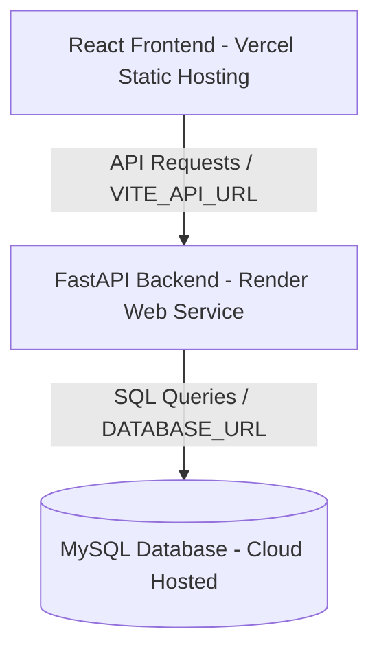

# Deployment Guide for Vercel (DEPLOY_VERCEL.md)

This guide walks you through deploying the **SplitEase React Frontend** on [Vercel](https://vercel.com/), connected to your backend database and server.

---

## Recommended Production Architecture

Vercel is optimized for fast static frontend hosting, while persistent ASGI servers (like FastAPI) and databases run best on platforms like Render or dedicated cloud providers.



---

## Step 1: Deploy Frontend on Vercel

1. Log in to your [Vercel Dashboard](https://vercel.com/).
2. Click **Add New** > **Project**.
3. Import your GitHub repository: `https://github.com/yashanandd/shared_expense_tracker`.
4. Configure the project settings:
   - **Framework Preset**: `Vite` (automatically detected)
   - **Root Directory**: `frontend`
   - **Build Command**: `npm run build`
   - **Output Directory**: `dist`
5. Under **Environment Variables**, add:
   - `VITE_API_URL`: The production URL of your FastAPI backend (e.g. `https://splitease-backend.onrender.com`).
6. Click **Deploy**. Vercel will build and host your site, generating a domain like `https://splitease.vercel.app`.

---

## Step 2: SPA Client Routing Configuration

To support React Router single-page application URLs on page reloads (preventing `404 Not Found` errors), a [vercel.json](file:///c:/Users/hiii/Desktop/Shared_Expense/frontend/vercel.json) file has been pre-configured in your `frontend` directory:

```json
{
  "cleanUrls": true,
  "rewrites": [
    {
      "source": "/(.*)",
      "destination": "/index.html"
    }
  ]
}
```

Vercel reads this file during deployment and routes all paths back to the React client handler.

---

## Step 3: Update Backend CORS Origins

Once your Vercel deployment finishes:
1. Copy the Vercel site URL (e.g. `https://splitease.vercel.app`).
2. Go to your **FastAPI Backend Service** dashboard (e.g., on Render).
3. Update the `ALLOWED_ORIGINS` environment variable to authorize your new Vercel domain:
   ```env
   ALLOWED_ORIGINS=http://localhost:5173,http://localhost:5174,https://splitease.vercel.app
   ```
4. Redeploy the backend. The API will now safely accept secure requests from your Vercel site.
